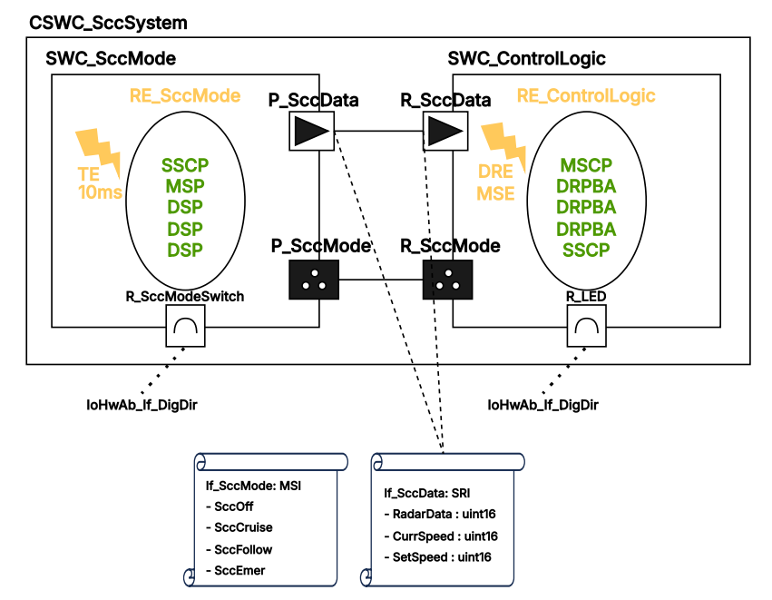
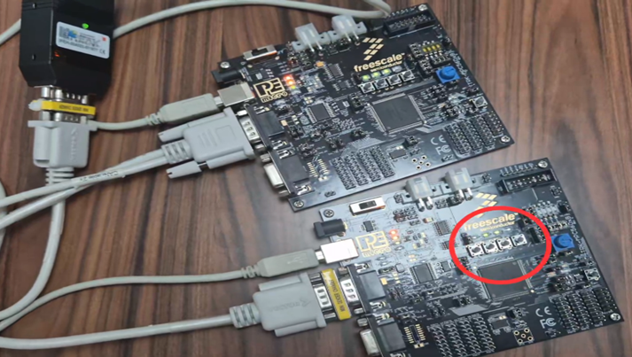
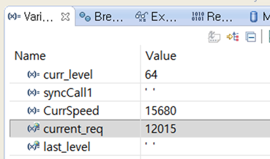
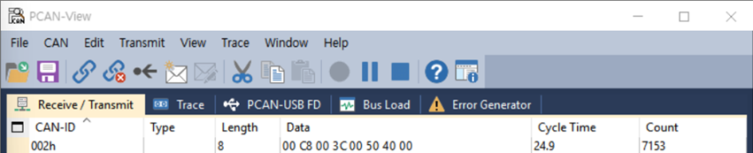
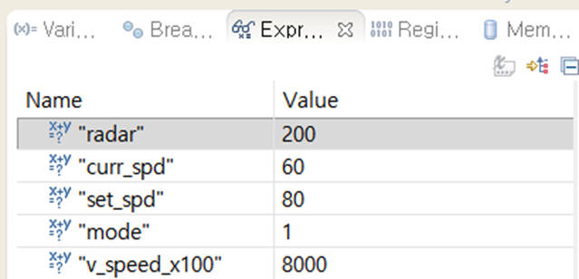
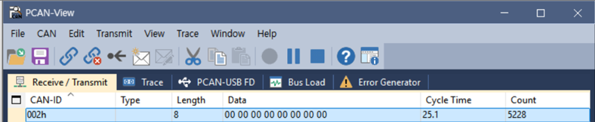
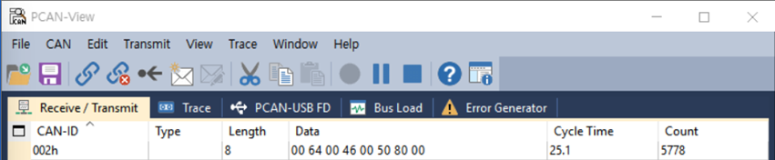

# AUTOSAR Classic 기반 SCC(스마트 크루즈 컨트롤) ECU 구성 및 통신 통합
> **MOBIUS BOOTCAMP 1기 PBL 최종 결과물** (2026.03.09 ~ 2026.03.27)

AUTOSAR Classic 표준을 준수하여 분산 ECU 환경에서의 스마트 크루즈 컨트롤(SCC) 시스템을 설계하고 검증한 프로젝트입니다.

* **System Topology:** 2-ECU 분산 환경 (ECU1: 센싱 및 모드 결정, ECU2: 주행 제어 및 액추에이터 구동)
* **팀 구성:** 박수빈(팀장) 외 팀원 3명

## 1. 담당 역할 및 핵심 기여
* **시스템 설계 주도:** ECU1/ECU2 SWC 아키텍처 및 포트 인터페이스 전체 설계
* **ECU1 모드 결정 로직:** Mode 0~3 간의 상태 전이(State Machine) 구현
* **통합 빌드 및 검증:** CodeWarrior에서 MPC5606B 타겟 빌드 및 PCAN-View로 CAN 통신 확인

 

## 2. Tech Stack

| 구분 | 항목 |
|:---|:---|
| **Language** | C |
| **Architecture** | AUTOSAR Classic Platform |
| **Framework** | Mobilgene (Standard Software Platform) |
| **Communication** | CAN Protocol (DBC 기반 메시지 정의) |
| **IDE / Debugger** | CodeWarrior (MPC5606B 타겟 빌드) |
| **CAN Monitoring** | PCAN-View |

 

## 3. SWC Architecture Modeling

* ECU1은 센서 데이터를 샘플링(10ms 주기)하여 주행 모드를 결정하고 CAN 메시지(25ms 주기)로 ECU2에 전달합니다.
* ECU2는 수신 즉시(DataReceivedEvent) 제어 로직을 실행하여 폴링 기반 대비 수신 대기 지연을 제거했습니다.

 

## 4. 주요 기능 및 모드별 동작

### 주행 모드별 상세 동작

| 모드 | 상태 명칭 | 핵심 동작 | LED 피드백 |
|:---|:---|:---|:---|
| **Mode 0** | **SccOff** | 시스템 비활성화. 초기화 및 제어 해제 시 진입합니다. | **OFF** |
| **Mode 1** | **SccCruise** | 전방 차량 없음. 목표 속도(`SetSpeed`)까지 일정 기울기로 가속합니다. | 가속 중 **점멸**, 도달 시 **ON** |
| **Mode 2** | **SccFollow** | 전방 차량 감지. 레이더 거리 임계값 기준으로 가속/감속을 전환하여 간격을 유지합니다. | 조절 중 **점멸**, 목표 속도 도달 시 **ON** |
| **Mode 3** | **SccEmer** | 긴급 제동(AEB). 최대 감속 기울기를 적용하여 급제동합니다. | **빠른 점멸**, 정지 시 **ON** |

<ㅠㄱ>

### 가감속 제어

목표 속도에 즉시 도달하지 않고, 25ms 수신 주기마다 고정 스텝을 가감하는 Slew-Rate Limiter(램핑)를 적용했습니다. 1 unit = 0.01 km/h 기준입니다.

| 주행 모드 | 25ms당 스텝 | 환산 변화율 |
|:---|:---|:---|
| SccCruise | 5 | 2.0 km/h/s |
| SccFollow | 5 또는 8 (조건부) | 2.0 ~ 3.2 km/h/s |
| SccEmer | 150 | 60.0 km/h/s |

 

### 시연 동영상
**YouTube:** [최종 결과물 시연 동영상 바로가기](https://youtu.be/_xWYteyaTxE)

 

## 5. Troubleshooting

### 5.1. ECU 변수 비정상 출력 해결
* **Problem:** CodeWarrior 디버깅 시 제어 변수 `current_req`가 비정상적인 값을 출력했습니다.

* **Analysis:** 데이터 오염이 무작위로 발생하는 양상에서 Stack Overflow를 의심했습니다.
* **Solution:** AUTOSAR OS 설정에서 해당 Task의 Stack Size를 2배 확장(1,024 → 2,048 Bytes)했습니다.
* **Result:** 변수값이 정상 범위로 복귀하여 Stack Overflow가 근본 원인이었음을 확인했습니다.

### 5.2. CAN 통신 단절 해결
* **Problem:** ECU 간 CAN 메시지 송수신이 이루어지지 않았습니다.
* **Analysis:** Mobilgene 내 CAN 설정을 반복 수정해도 증상이 지속되어 HW 결함을 의심했습니다.
* **Solution:** 보드 내 CAN 점퍼 배선의 오결선을 발견하여 재연결했습니다.
* **Result:** 물리적 연결 정상화 이후 CAN 통신이 복구되었습니다.

  

  

 

## 6. CAN 통신 주기 검증

PCAN-View를 통해 핵심 메시지(ID: 0x02)의 전송 주기를 측정한 결과, 실측 24.9ms ~ 25.1ms로 설계값 25ms 대비 ±0.1ms 이내의 정상 편차를 확인했습니다.

설계값 산출: Com_Cfg.c 설정값 0x28(40) × Com_MainFunctionTx 호출 주기 0.625ms = 25ms

PCAN-View 캡처 (Mode0 ~ Mode3)

#### Mode0

#### Mode1

#### Mode2

#### Mode3

---

*본 레포지토리는 저작권 보호를 위해 전체 환경을 제외한 핵심 로직 위주로 구성되었습니다.*
